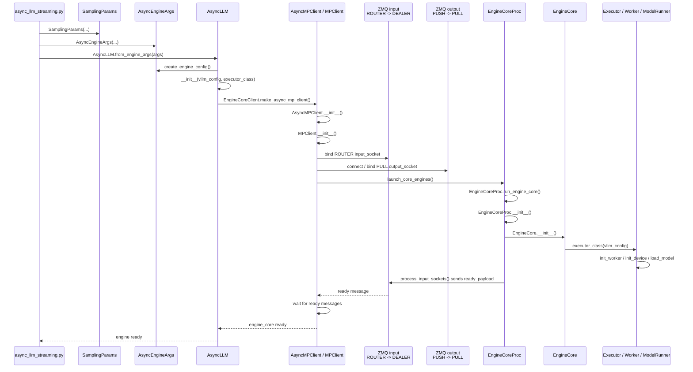
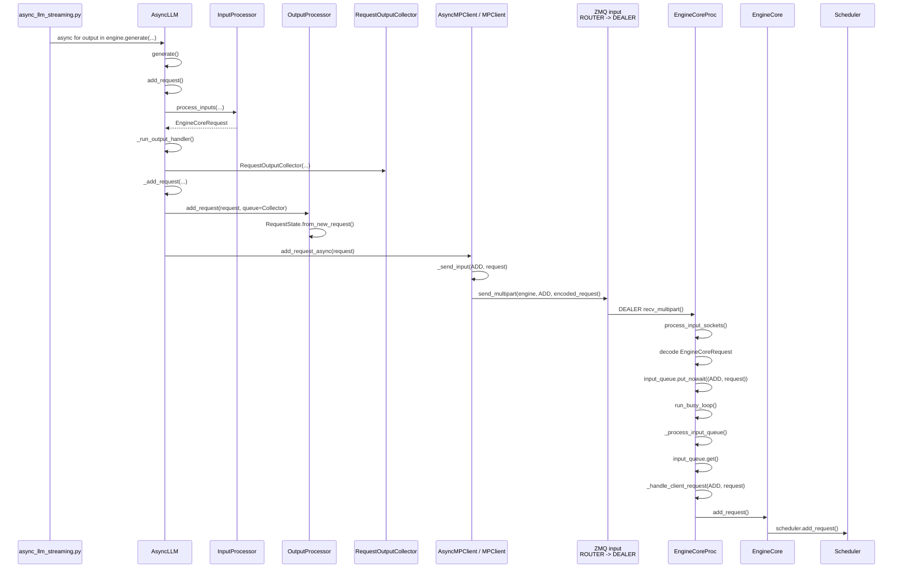
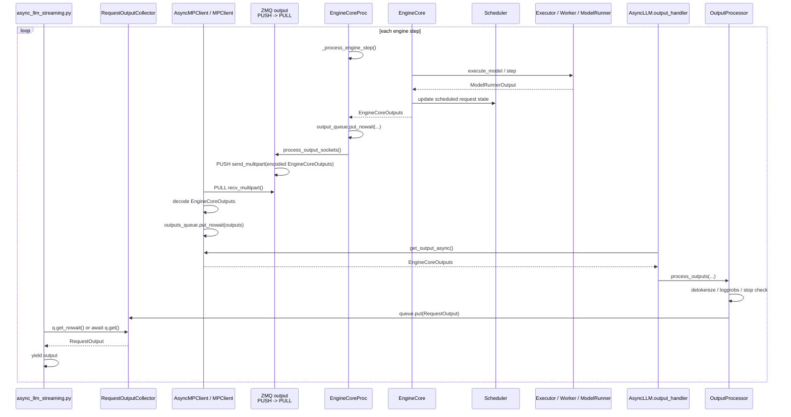

## Phase 1. Engine Initialization

```mermaid
sequenceDiagram
    participant User as async_llm_streaming.py
    participant Params as SamplingParams
    participant Args as AsyncEngineArgs
    participant AsyncLLM as AsyncLLM
    participant Client as AsyncMPClient / MPClient
    participant ZMQIn as ZMQ input<br/>ROUTER -> DEALER
    participant ZMQOut as ZMQ output<br/>PUSH -> PULL
    participant CoreProc as EngineCoreProc
    participant Core as EngineCore
    participant Runner as Executor / Worker / ModelRunner

    User->>Params: SamplingParams(...)
    User->>Args: AsyncEngineArgs(...)
    User->>AsyncLLM: AsyncLLM.from_engine_args(args)

    AsyncLLM->>Args: create_engine_config()
    AsyncLLM->>AsyncLLM: __init__(vllm_config, executor_class)
    AsyncLLM->>Client: EngineCoreClient.make_async_mp_client()

    Client->>Client: AsyncMPClient.__init__()
    Client->>Client: MPClient.__init__()
    Client->>ZMQIn: bind ROUTER input_socket
    Client->>ZMQOut: connect / bind PULL output_socket

    Client->>CoreProc: launch_core_engines()
    CoreProc->>CoreProc: EngineCoreProc.run_engine_core()
    CoreProc->>CoreProc: EngineCoreProc.__init__()
    CoreProc->>Core: EngineCore.__init__()

    Core->>Runner: executor_class(vllm_config)
    Runner->>Runner: init_worker / init_device / load_model

    CoreProc->>ZMQIn: process_input_sockets() sends ready_payload
    ZMQIn-->>Client: ready message
    Client->>Client: wait for ready messages
    Client-->>AsyncLLM: engine_core ready
    AsyncLLM-->>User: engine ready
```

## Phase 2-5. Request Submission and Engine Scheduling

```mermaid
sequenceDiagram
    participant User as async_llm_streaming.py
    participant AsyncLLM as AsyncLLM
    participant InputProc as InputProcessor
    participant OutProc as OutputProcessor
    participant Collector as RequestOutputCollector
    participant Client as AsyncMPClient / MPClient
    participant ZMQIn as ZMQ input<br/>ROUTER -> DEALER
    participant CoreProc as EngineCoreProc
    participant Core as EngineCore
    participant Scheduler as Scheduler

    User->>AsyncLLM: async for output in engine.generate(...)
    AsyncLLM->>AsyncLLM: generate()
    AsyncLLM->>AsyncLLM: add_request()

    AsyncLLM->>InputProc: process_inputs(...)
    InputProc-->>AsyncLLM: EngineCoreRequest

    AsyncLLM->>AsyncLLM: _run_output_handler()
    AsyncLLM->>Collector: RequestOutputCollector(...)
    AsyncLLM->>AsyncLLM: _add_request(...)

    AsyncLLM->>OutProc: add_request(request, queue=Collector)
    OutProc->>OutProc: RequestState.from_new_request()

    AsyncLLM->>Client: add_request_async(request)
    Client->>Client: _send_input(ADD, request)
    Client->>ZMQIn: send_multipart(engine, ADD, encoded_request)

    ZMQIn->>CoreProc: DEALER recv_multipart()
    CoreProc->>CoreProc: process_input_sockets()
    CoreProc->>CoreProc: decode EngineCoreRequest
    CoreProc->>CoreProc: input_queue.put_nowait((ADD, request))

    CoreProc->>CoreProc: run_busy_loop()
    CoreProc->>CoreProc: _process_input_queue()
    CoreProc->>CoreProc: input_queue.get()
    CoreProc->>CoreProc: _handle_client_request(ADD, request)

    CoreProc->>Core: add_request()
    Core->>Scheduler: scheduler.add_request()
```

## Phase 6. Engine Step, Output Processing, and Streaming

```mermaid
sequenceDiagram
    participant User as async_llm_streaming.py
    participant Collector as RequestOutputCollector
    participant Client as AsyncMPClient / MPClient
    participant ZMQOut as ZMQ output<br/>PUSH -> PULL
    participant CoreProc as EngineCoreProc
    participant Core as EngineCore
    participant Scheduler as Scheduler
    participant Runner as Executor / Worker / ModelRunner
    participant Handler as AsyncLLM.output_handler
    participant OutProc as OutputProcessor

    loop each engine step
        CoreProc->>CoreProc: _process_engine_step()
        Core->>Runner: execute_model / step
        Runner-->>Core: ModelRunnerOutput

        Core->>Scheduler: update scheduled request state
        Core-->>CoreProc: EngineCoreOutputs

        CoreProc->>CoreProc: output_queue.put_nowait(...)
        CoreProc->>ZMQOut: process_output_sockets()
        ZMQOut->>ZMQOut: PUSH send_multipart(encoded EngineCoreOutputs)

        Client->>ZMQOut: PULL recv_multipart()
        Client->>Client: decode EngineCoreOutputs
        Client->>Client: outputs_queue.put_nowait(outputs)

        Handler->>Client: get_output_async()
        Client-->>Handler: EngineCoreOutputs

        Handler->>OutProc: process_outputs(...)
        OutProc->>OutProc: detokenize / logprobs / stop check
        OutProc->>Collector: queue.put(RequestOutput)

        User->>Collector: q.get_nowait() or await q.get()
        Collector-->>User: RequestOutput
        User->>User: yield output
    end
```
