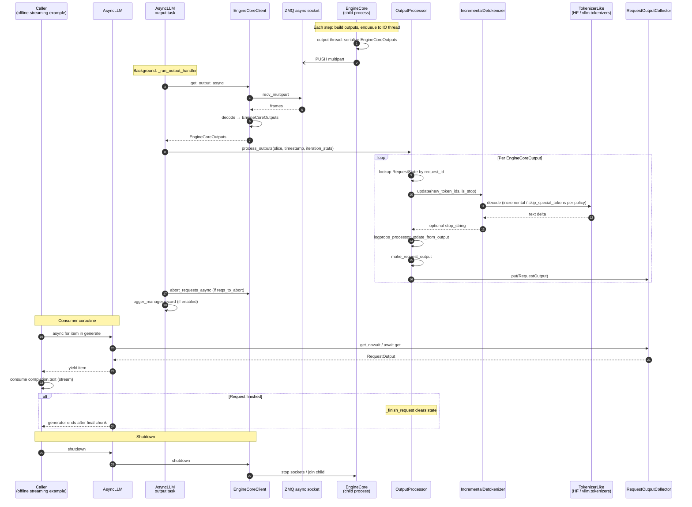

# vLLM AsyncLLM（meta-llama/Llama-3.2-1B-Instruct）

下面三个 Mermaid 时序图分别覆盖：**引擎初始化与模型加载**、**单步推理（一次 step）**、**流式回流（token 流出）**。`participant` 全部使用 `类名 (相对路径)` 的形式，从顶层 Python 入口一直贯通到底层 CUDA / FlashAttention 后端。

---

## 1. 引擎初始化与模型加载

```mermaid
sequenceDiagram
    autonumber
    participant Main as main
    participant Args as AsyncEngineArgs
    participant LLM as AsyncLLM
    participant InProc as InputProcessor
    participant OutProc as OutputProcessor
    participant Client as AsyncMPClient
    participant MPClient as MPClient
    participant ProcMgr as CoreEngineProcManager
    participant ActorMgr as CoreEngineActorManager
    participant EngineCoreActor as EngineCoreActor
    participant Proc as EngineCoreProc
    participant Utils as utils.py
    participant Core as EngineCore
    participant Exec as MultiprocExecutor
    participant WProc as WorkerProc
    participant Worker as Worker
    participant Runner as GPUModelRunner
    participant Loader as DefaultModelLoader
    participant LlamaTop as LlamaForCausalLM
    participant LlamaModel as LlamaModel
    participant Sched as Scheduler
    participant Cuda as torch.cuda / NCCL

    Main->>Args: AsyncEngineArgs(model="meta-llama/Llama-3.2-1B-Instruct")
    Main->>LLM: AsyncLLM.from_engine_args(engine_args)
    LLM->>Args: create_engine_config(usage_context)
    Args-->>LLM: VllmConfig (model/cache/parallel/scheduler/...)
    LLM->>LLM: __init__(vllm_config, executor_class=MultiprocExecutor)
    LLM->>InProc: InputProcessor(vllm_config, renderer)
    LLM->>OutProc: OutputProcessor(tokenizer, log_stats, stream_interval)
    LLM->>Client: EngineCoreClient.make_async_mp_client(vllm_config, executor_class)

    Client->>MPClient: __init__(asyncio_mode=True, ...)
    MPClient->>MPClient: zmq.Context + ROUTER(input) / PULL(output) sockets
    MPClient->>Utils: launch_core_engines(vllm_config, executor_class, log_stats, addresses)

    alt data_parallel_backend == "ray"
        Utils->>ActorMgr: <<create>> CoreEngineActorManager(vllm_config....)
        ActorMgr->>EngineCoreActor: ray.remote(EngineCoreActor).remote(...)
    else multiprocessing / local backend
        Utils->>ProcMgr: <<create>> CoreEngineProcManager(vllm_config...)
        ProcMgr->>Proc: mp.Process(target=EngineCoreProc.run_engine_core).start()
    end

    Note over Proc: ===== 子进程 EngineCore =====
    Proc->>Proc: <<create>> EngineCoreProc(...)
    Proc->>Proc: _perform_handshakes(...) -> make_zmq_socket()负责创建 socket、设置缓冲区/身份/连接参数，然后根据 bind 决定是监听地址还是连接地址 
    Proc->>Core: super().__init__(vllm_config, executor_class, log_stats)
    Core->>Exec: MultiprocExecutor(vllm_config)
    Exec->>Exec: _init_executor() — 建 SHM MessageQueue (rpc_broadcast / response)
    Exec->>WProc: make_worker_process(local_rank, rank, …) × world_size
    WProc->>Worker: WorkerWrapperBase.init_worker(...) → Worker(vllm_config)
    Worker->>Cuda: torch.cuda.set_device(local_rank), init NCCL group
    Worker->>Runner: GPUModelRunner(vllm_config, device)
    Worker->>Worker: load_model()
    Worker->>Runner: model_runner.load_model()
    Runner->>Loader: get_model_loader(load_config).load_model(...)
    Loader->>LlamaTop: LlamaForCausalLM(vllm_config, prefix="")
    LlamaTop->>LlamaModel: LlamaModel(vllm_config) (Embed + N×LlamaDecoderLayer + Norm + lm_head)
    Loader-->>Runner: HuggingFace safetensors → 切分到 TP rank → 加载到 CUDA
    Runner-->>Worker: model 就绪
    WProc-->>Exec: READY (通过 ready_pipe)

    Core->>Core: _initialize_kv_caches(vllm_config)
    Core->>Exec: get_kv_cache_specs() / determine_available_memory()
    Exec->>Worker: collective_rpc("get_kv_cache_spec") / ("determine_available_memory")
    Worker->>Runner: profile_run() — 测 KV 可用显存
    Worker->>Cuda: torch.cuda.synchronize / mem_get_info
    Core->>Exec: initialize_from_config(kv_cache_configs)
    Exec->>Worker: collective_rpc("initialize_from_config" / "compile_or_warm_up_model")
    Worker->>Runner: 分配 KV cache blocks + torch.compile 预热 + CUDA Graph 捕获
    Core->>Sched: Scheduler(vllm_config, kv_cache_config, ...)
    Proc-->>MPClient: HELLO / READY (ZMQ handshake_socket)

    MPClient-->>Client: 各 EngineCore READY 收齐
    Client-->>LLM: AsyncMPClient 实例就绪
    LLM->>LLM: 若已有事件循环则 _run_output_handler()
    LLM-->>Main: engine = AsyncLLM 已就绪
```



#### `main -> AsyncEngineArgs`：

创建 `AsyncEngineArgs(model="meta-llama/Llama-3.2-1B-Instruct")`。

#### `main -> AsyncLLM`：

调用 `AsyncLLM.from_engine_args(engine_args)` 启动异步引擎, AsyncLLM is an asynchronous wrapper for the vLLM engine.。

#### `AsyncLLM -> AsyncEngineArgs`：

调用 `create_engine_config(usage_context)` 生成配置。

#### `AsyncEngineArgs -> AsyncLLM`：

返回 `VllmConfig`。

#### `AsyncLLM -> AsyncLLM`：

初始化 `AsyncLLM(vllm_config, executor_class=MultiprocExecutor)`

#### AsyncLLM -> InputProcessor：

创建 InputProcessor，负责把用户输入转成 vLLM 内部请求格式。初始化请求转换器`InputProcessor(vllm_config, renderer)`，==保存 model/cache/lora/scheduler/speculative/structured_outputs 等配置==，并准备 InputPreprocessor；后续 add_request() 时，它会校验 SamplingParams/PoolingParams、LoRA、DP rank，把 raw prompt 或 renderer 输出转成 EngineCoreRequest，里面包含 prompt_token_ids、prompt_embeds、mm_features、采样参数、到达时间、优先级等。

```
self.input_preprocessor = InputPreprocessor(
    vllm_config,
    renderer=renderer,
    mm_registry=mm_registry,
)
```

**EngineCoreRequest - 纯文本请求**

```
def process_inputs(
    self,
    request_id: str,
    prompt: PromptType | EngineInput,
    params: SamplingParams | PoolingParams,
    supported_tasks: tuple[SupportedTask, ...],
    arrival_time: float | None = None,
    lora_request: LoRARequest | None = None,
    tokenization_kwargs: dict[str, Any] | None = None,
    trace_headers: Mapping[str, str] | None = None,
    priority: int = 0,
    data_parallel_rank: int | None = None,
    resumable: bool = False,
) -> EngineCoreRequest:
.....
EngineCoreRequest(
    request_id="req-1",
    prompt_token_ids=[9906, 11, 889, 527, 499, 30],
    prompt_embeds=None,
    prompt_is_token_ids=False,
    mm_features=None,
    sampling_params=SamplingParams(
        max_tokens=8,
        temperature=0.7,
        top_p=0.9,
    ),
    pooling_params=None,
    arrival_time=1710000000.123,
    lora_request=None,
    cache_salt=None,
    priority=3,
    data_parallel_rank=None,
    trace_headers=None,
    resumable=False,
)
```

-   request_id="req-1"：这个请求叫 req-1，后端返回结果也带这个 ID。
-   prompt_token_ids=[9906, ...]："Hello, who are you?" 被 tokenizer 后的 token。
-   prompt_embeds=None：用户没有直接传 embedding。
-   prompt_is_token_ids=False：用户传的是字符串，不是 token id 列表。
-   mm_features=None：这是纯文本请求，没有图片、音频等多模态输入。
-   sampling_params=...：最多生成 8 个 token，温度 0.7，top_p 0.9。
-   pooling_params=None：这不是 embedding / pooling 请求，而是生成请求。
-   arrival_time=...：请求进入系统的时间，用来统计排队和延迟。
-   lora_request=None：没有指定 LoRA adapter。
-   cache_salt=None：没有额外隔离 prefix cache。
-   priority=3：调度优先级是 3。
-   data_parallel_rank=None：不手动指定 DP rank，让 vLLM 自己分配。
-   trace_headers=None：没有传链路追踪 header。
-   resumable=False：这个请求不支持暂停恢复。

**EngineCoreRequest - Lora**

```
EngineCoreRequest(
    request_id="req-2",
    prompt_token_ids=[...],
    sampling_params=SamplingParams(max_tokens=16),
    lora_request=LoRARequest("fr-adapter", 1, "/path/to/lora"),
    mm_features=None,
    pooling_params=None,
)
```


#### AsyncLLM -> OutputProcessor：

创建 OutputProcessor，负责把模型输出整理成流式或最终结果. 初始化结果状态管理器`OutputProcessor(tokenizer, log_stats, stream_interval)`，保存 tokenizer、stream_interval 和每个请求的 RequestState；==后续 EngineCore 每吐出一批 EngineCoreOutput，它会按 request id 找状态，统计日志，detokenize 新 token，处理 stop string / logprobs / finish reason，然后生成 RequestOutput 放进该请求的 async queue。== 

#### AsyncLLM -> EngineCoreClient：

创建异步多进程 EngineCore 客户端。调用 `EngineCoreClient.make_async_mp_client(...)`,初始化真正和后端 EngineCore 通信的客户端；在普通 AsyncLLM 多进程模式下会返回 AsyncMPClient，它负责启动/连接 EngineCore 后台进程，把 EngineCoreRequest 异步发过去，再从后端异步拉取 EngineCoreOutputs。


- `EngineCoreClient -> MPClient`：创建异步模式的 `MPClient(asyncio_mode=True, ...)`。
- `MPClient -> MPClient`：创建 ZMQ `Context`、`ROUTER` 输入 socket 和 `PULL` 输出 socket。
- `MPClient -> utils.py`：调用 `launch_core_engines(...)` 启动 EngineCore。
- `utils.py -> CoreEngineActorManager`：Ray 后端创建 `CoreEngineActorManager`。
- `CoreEngineActorManager -> EngineCoreActor`：通过 `ray.remote(EngineCoreActor).remote(...)` 启动 Ray actor。
- `utils.py -> CoreEngineProcManager`：本地多进程后端创建 `CoreEngineProcManager`。
- `CoreEngineProcManager -> EngineCoreProc`：启动 `mp.Process(target=EngineCoreProc.run_engine_core)`。
- `EngineCoreProc -> EngineCoreProc`：子进程创建 `EngineCoreProc(...)`。
- `EngineCoreProc -> EngineCoreProc`：执行 `_perform_handshakes(...)` 建立 ZMQ 通信。
- `EngineCoreProc -> EngineCore`：调用父类初始化 `EngineCore`。
- `EngineCore -> MultiprocExecutor`：创建 `MultiprocExecutor(vllm_config)`。
- `MultiprocExecutor -> MultiprocExecutor`：初始化共享内存 `MessageQueue`。
- `MultiprocExecutor -> WorkerProc`：按 `world_size` 创建多个 `WorkerProc`。
- `WorkerProc -> Worker`：通过 `WorkerWrapperBase.init_worker(...)` 初始化 `Worker`。
- `Worker -> torch.cuda / NCCL`：设置 GPU 设备并初始化 NCCL 通信组。
- `Worker -> GPUModelRunner`：创建 `GPUModelRunner(vllm_config, device)`。
- `Worker -> Worker`：调用 `load_model()` 开始加载模型。
- `Worker -> GPUModelRunner`：调用 `model_runner.load_model()`。
- `GPUModelRunner -> DefaultModelLoader`：通过 `get_model_loader(load_config).load_model(...)` 加载模型。
- `DefaultModelLoader -> LlamaForCausalLM`：实例化 `LlamaForCausalLM(vllm_config, prefix="")`。
- `LlamaForCausalLM -> LlamaModel`：创建 `LlamaModel(vllm_config)` 主干网络。
- `DefaultModelLoader -> GPUModelRunner`：读取 HF safetensors，按 TP rank 切分后加载到 CUDA。
- `GPUModelRunner -> Worker`：返回加载完成的模型。
- `WorkerProc -> MultiprocExecutor`：通过 `ready_pipe` 发送 `READY`。
- `EngineCore -> EngineCore`：调用 `_initialize_kv_caches(vllm_config)`。
- `EngineCore -> MultiprocExecutor`：查询 KV cache 规格和可用显存。
- `MultiprocExecutor -> Worker`：广播 `get_kv_cache_spec` 和 `determine_available_memory` RPC。
- `Worker -> GPUModelRunner`：执行 `profile_run()` 测算 KV cache 可用显存。
- `Worker -> torch.cuda / NCCL`：执行 CUDA 同步并读取显存信息。
- `EngineCore -> MultiprocExecutor`：调用 `initialize_from_config(kv_cache_configs)`。
- `MultiprocExecutor -> Worker`：广播 `initialize_from_config` 和 `compile_or_warm_up_model` RPC。
- `Worker -> GPUModelRunner`：分配 KV cache blocks，并执行模型预热和 CUDA Graph 捕获。
- `EngineCore -> Scheduler`：创建 `Scheduler(vllm_config, kv_cache_config, ...)`。
- `EngineCoreProc -> MPClient`：通过 ZMQ handshake socket 发送 `HELLO / READY`。
- `MPClient -> EngineCoreClient`：收齐所有 EngineCore 的 READY 信号。
- `EngineCoreClient -> AsyncLLM`：返回就绪的 `AsyncMPClient` 实例。
- `AsyncLLM -> AsyncLLM`：如果已有事件循环，启动 `_run_output_handler()`。
- `AsyncLLM -> main`：返回已就绪的 `AsyncLLM` engine。


---

## 2. 单步推理（一次 EngineCore step）

```mermaid
sequenceDiagram
    autonumber
    participant Main as stream_response (examples/offline_inference/async_llm_streaming.py)
    participant LLM as AsyncLLM (vllm/v1/engine/async_llm.py)
    participant InProc as InputProcessor (vllm/v1/engine/input_processor.py)
    participant OutProc as OutputProcessor (vllm/v1/engine/output_processor.py)
    participant Client as AsyncMPClient (vllm/v1/engine/core_client.py)
    participant Proc as EngineCoreProc (vllm/v1/engine/core.py)
    participant Core as EngineCore (vllm/v1/engine/core.py)
    participant Sched as Scheduler (vllm/v1/core/sched/scheduler.py)
    participant Exec as MultiprocExecutor (vllm/v1/executor/multiproc_executor.py)
    participant WProc as WorkerProc (vllm/v1/executor/multiproc_executor.py)
    participant Worker as Worker (vllm/v1/worker/gpu_worker.py)
    participant Runner as GPUModelRunner (vllm/v1/worker/gpu_model_runner.py)
    participant LlamaTop as LlamaForCausalLM (vllm/model_executor/models/llama.py)
    participant LlamaModel as LlamaModel (vllm/model_executor/models/llama.py)
    participant Layer as LlamaDecoderLayer (vllm/model_executor/models/llama.py)
    participant Attn as Attention (vllm/model_executor/layers/attention/attention.py)
    participant FAImpl as FlashAttentionImpl (vllm/v1/attention/backends/flash_attn.py)
    participant FAIface as flash_attn_varlen_func (vllm/vllm_flash_attn/flash_attn_interface.py)
    participant FAKernel as _vllm_fa2_C / _vllm_fa3_C (csrc/.../flash_api.cpp + CUDA kernel)
    participant Sampler as Sampler (vllm/v1/sample/sampler.py)
    participant Cuda as CUDA Stream / KV Cache (torch + reshape_and_cache_flash)

    Main->>LLM: async for out in engine.generate(req_id, prompt, sampling_params)
    LLM->>LLM: add_request(req_id, prompt, params)
    LLM->>InProc: process_inputs(req_id, prompt, params, supported_tasks)
    InProc->>InProc: tokenizer.encode(prompt) → prompt_token_ids
    InProc-->>LLM: EngineCoreRequest(request_id, prompt_token_ids, sampling_params)
    LLM->>OutProc: add_request(request, prompt_text, parent_req=None, idx=0, queue)
    OutProc->>OutProc: 创建 RequestState + IncrementalDetokenizer + RequestOutputCollector
    LLM->>Client: add_request_async(EngineCoreRequest)
    Client->>Proc: zmq.send_multipart([engine_id, ADD, msgpack(EngineCoreRequest)])

    Note over Proc,Core: ===== EngineCoreProc.run_busy_loop =====
    Proc->>Proc: process_input_sockets 线程: socket.recv → input_queue
    Proc->>Core: _process_input_queue() → _handle_client_request(ADD, req)
    Core->>Sched: add_request(Request)

    Core->>Core: _process_engine_step() → step_fn = step()
    Core->>Sched: schedule()
    Sched->>Sched: 选 batch + 分配 KV blocks + build SchedulerOutput (block_table, slot_mapping, ...)
    Sched-->>Core: SchedulerOutput
    Core->>Exec: execute_model(scheduler_output, non_block=True)
    Exec->>Exec: rpc_broadcast_mq.enqueue(("execute_model", (sched_out,), ...))

    Note over WProc,Worker: ===== Worker 子进程 =====
    WProc->>WProc: worker_busy_loop() → dequeue("execute_model")
    WProc->>Worker: worker.execute_model(scheduler_output)
    Worker->>Runner: model_runner.execute_model(scheduler_output, intermediate_tensors)
    Runner->>Runner: _update_states / _prepare_inputs (input_ids, positions, slot_mapping → GPU)
    Runner->>Runner: set_forward_context(attn_metadata, ...)  # 给 Attention 层注入 metadata
    Runner->>LlamaTop: model(input_ids, positions, intermediate_tensors, inputs_embeds)
    LlamaTop->>LlamaModel: forward(input_ids, positions, ...)
    LlamaModel->>LlamaModel: embed_tokens(input_ids) → hidden_states
    loop 每个 LlamaDecoderLayer (1B 模型共 16 层)
        LlamaModel->>Layer: layer(positions, hidden_states, residual)
        Layer->>Layer: input_layernorm (RMSNorm fused)
        Layer->>Attn: self_attn.forward(positions, hidden_states)
        Attn->>Attn: qkv_proj + split + rotary_emb (RoPE CUDA op)
        Attn->>Attn: torch.ops.vllm.unified_attention_with_output(q,k,v,output,layer_name)
        Attn->>FAImpl: FlashAttentionImpl.forward(q,k,v,kv_cache,attn_metadata,output)
        FAImpl->>Cuda: reshape_and_cache_flash(k,v,key_cache,value_cache,slot_mapping)
        FAImpl->>FAIface: flash_attn_varlen_func(q,k_cache,v_cache,...,block_table,causal=True)
        FAIface->>FAKernel: torch.ops._vllm_fa2_C.varlen_fwd / _vllm_fa3_C.fwd(...)
        FAKernel-->>FAIface: out tensor (CUDA)
        FAIface-->>FAImpl: returns
        FAImpl-->>Attn: output
        Attn-->>Layer: o_proj(attn_out)
        Layer->>Layer: post_attention_layernorm + LlamaMLP (gate_up_proj/SiluAndMul/down_proj)
    end
    LlamaModel->>LlamaModel: norm(hidden_states, residual) → hidden_states
    LlamaModel-->>LlamaTop: hidden_states
    LlamaTop-->>Runner: hidden_states (CUDA Graph replay 路径)

    Runner-->>Worker: 缓存 logits / hidden_states，返回 None (异步采样模式)
    Worker-->>WProc: response (mq.enqueue)
    Exec-->>Core: future.result() → ModelRunnerOutput=None
    Core->>Sched: get_grammar_bitmask(scheduler_output)
    Core->>Exec: sample_tokens(grammar_output)
    Exec->>WProc: collective_rpc("sample_tokens", ...)
    WProc->>Worker: worker.sample_tokens(grammar_output)
    Worker->>Runner: model_runner.sample_tokens(grammar_output)
    Runner->>LlamaTop: compute_logits(hidden_states) (lm_head)
    Runner->>Sampler: sampler(logits, sampling_metadata)  # temperature/top_p/seed=42
    Sampler->>Cuda: top-k/top-p + multinomial (CUDA)
    Sampler-->>Runner: SamplerOutput(sampled_token_ids on GPU)
    Runner->>Runner: _bookkeeping_sync (D2H copy of token_ids, logprobs)
    Runner-->>Worker: ModelRunnerOutput(req_ids, sampled_token_ids, logprobs, ...)
    Worker-->>WProc: response
    Exec-->>Core: ModelRunnerOutput

    Core->>Sched: update_from_output(scheduler_output, model_output)
    Sched-->>Core: dict[client_idx → EngineCoreOutputs] (含 new_token_ids)
    Core->>Proc: output_queue.put_nowait((client_idx, EngineCoreOutputs))
```



要点说明：
- `step` 与 `sample_tokens` 是 V1 调度的解耦点：先发出非阻塞 `execute_model`（前向 + KV 写入），再由 `sample_tokens` 拿到 logits 后采样，便于流水线/CUDA Graph 重放。
- Attention 走 `unified_attention_with_output` 自定义算子 → `FlashAttentionImpl.forward` → `flash_attn_varlen_func` → `torch.ops._vllm_fa2_C.varlen_fwd` / `_vllm_fa3_C.fwd`，最终落到 `csrc/` 下的 FlashAttention CUDA kernel；KV 写入由 `reshape_and_cache_flash` 这个 CUDA op 完成（Paged KV 的 `block_table + slot_mapping`）。
- `Sampler` 内部对 1B 模型做温度缩放 / top-p / multinomial，全部走 CUDA op。

---

## 3. 流式回流（token-by-token 出口）



要点说明：
- `_run_output_handler` 是 `AsyncLLM` 在事件循环中常驻的后台任务，负责把 ZMQ 拉过来的 `EngineCoreOutputs` 喂给 `OutputProcessor`，并把每条请求的 `RequestOutput` 推到对应的 `RequestOutputCollector` 队列。
- `RequestOutputKind.DELTA` 模式下，`make_request_output` 只把本次新生成的 token 文本/ID 写入 `output.outputs[*].text`，例子里看到的就是这部分增量。
- 调用方协程 `generate()` 的 `async for` 直接消费上面那个 per-request 队列：`q.get_nowait() or await q.get()`，无锁的 fast path 用于负载较高时减少任务切换。
- 整个流式链路是 **生产者（EngineCore 子进程，ZMQ PUSH） → 消费者（AsyncLLM 后台 task） → 每请求 asyncio 队列 → 用户协程** 的三段式。

---

## 文件位置速查

### 用户入口和参数
- `examples/offline_inference/async_llm_streaming.py`
  - `main()`、`stream_response()`
- `vllm/sampling_params.py`
  - `SamplingParams`、`SamplingParams.__post_init__`、`update_from_generation_config`、`update_from_tokenizer`
- `vllm/engine/arg_utils.py`
  - `EngineArgs`、`AsyncEngineArgs`、`EngineArgs.create_engine_config`

### 前端引擎（asyncio 进程）
- `vllm/v1/engine/async_llm.py`
  - `AsyncLLM`、`AsyncLLM.__init__`、`from_engine_args`、`add_request`、`_add_request`、`generate`、`_run_output_handler`、`output_handler`、`abort`、`shutdown`
- `vllm/v1/engine/input_processor.py`
  - `InputProcessor`、`process_inputs`、`assign_request_id`、`_validate_params`
- `vllm/v1/engine/output_processor.py`
  - `OutputProcessor`、`OutputProcessor.add_request`、`process_outputs`、`RequestState`、`RequestState.from_new_request`、`RequestOutputCollector`
- `vllm/v1/engine/detokenizer.py`
  - `IncrementalDetokenizer.update`
- `vllm/v1/engine/logprobs.py`
  - `LogprobsProcessor.update_from_output`
- `vllm/v1/engine/__init__.py`
  - `EngineCoreRequest`、`EngineCoreOutput`、`EngineCoreOutputs`、`EngineCoreRequestType`、`EngineCoreReadyResponse`

### 多进程 / ZMQ 客户端
- `vllm/v1/engine/core_client.py`
  - `EngineCoreClient`、`MPClient`、`AsyncMPClient`、`DPAsyncMPClient`、`DPLBAsyncMPClient`
  - `EngineCoreClient.make_async_mp_client`、`MPClient.__init__`（建 ROUTER/PULL）、`MPClient._send_input`、`AsyncMPClient.get_output_async`、`AsyncMPClient.add_request_async`
- `vllm/v1/engine/utils.py`
  - `launch_core_engines`、`get_engine_zmq_addresses`、`make_zmq_socket`

### EngineCore 后端进程
- `vllm/v1/engine/core.py`
  - `EngineCore`、`EngineCore.__init__`、`_initialize_kv_caches`、`add_request`、`step`、`step_with_batch_queue`
  - `EngineCoreProc`、`run_engine_core`、`run_busy_loop`、`_process_input_queue`、`_process_engine_step`、`_handle_client_request`、`process_input_sockets`、`process_output_sockets`、`startup_handshake`
  - `DPEngineCoreProc`
- `vllm/v1/core/sched/scheduler.py`
  - `Scheduler`、`Scheduler.add_request`、`schedule`、`update_from_output`
- `vllm/v1/core/sched/output.py`
  - `SchedulerOutput`

### Executor / Worker
- `vllm/v1/executor/abstract.py`
  - `Executor`、`Executor.get_class`、`collective_rpc`、`execute_model`、`sample_tokens`、`initialize_from_config`、`determine_available_memory`
- `vllm/v1/executor/uniproc_executor.py`
  - `UniProcExecutor._init_executor`、`collective_rpc`、`execute_model`
- `vllm/v1/executor/multiproc_executor.py`
  - `MultiprocExecutor`、`WorkerProc`
- `vllm/v1/worker/worker_base.py`
  - `WorkerBase`、`WorkerWrapperBase.init_worker`、`init_device`、`load_model`、`initialize_from_config`、`execute_model`
- `vllm/v1/worker/gpu_worker.py`
  - `Worker`（继承 `WorkerBase`），`Worker.init_device`、`load_model`、`determine_available_memory`、`initialize_from_config`、`compile_or_warm_up_model`、`execute_model`、`init_worker_distributed_environment`

### Model Runner 与 CUDA Graph
- `vllm/v1/worker/gpu_model_runner.py`
  - `GPUModelRunner.__init__`、`load_model`、`initialize_kv_cache`、`_dummy_run`、`capture_model`、`execute_model`、`_determine_batch_execution_and_padding`、`_check_and_update_cudagraph_mode`
- `vllm/v1/worker/gpu/cudagraph_utils.py`
  - `CudagraphDispatcher`、`EagleCudaGraphManager` 等
- `vllm/forward_context.py`
  - `set_forward_context`、`BatchDescriptor`

### 模型加载
- `vllm/model_executor/model_loader/__init__.py`
  - `get_model_loader`、`get_model`
- `vllm/model_executor/model_loader/base_loader.py`
  - `BaseModelLoader.load_model`（调用 `initialize_model` + `load_weights` + `process_weights_after_loading`）
- `vllm/model_executor/model_loader/default_loader.py`
  - `DefaultModelLoader`、`_prepare_weights`（`download_weights_from_hf`、`safetensors_weights_iterator`）、`_get_weights_iterator`、`load_weights`
- `vllm/model_executor/model_loader/utils.py`
  - `initialize_model`、`process_weights_after_loading`
- `vllm/model_executor/model_loader/weight_utils.py`
  - `download_weights_from_hf`、`safetensors_weights_iterator`、`default_weight_loader`

### Llama 模型实现
- `vllm/model_executor/models/llama.py`
  - `LlamaMLP`、`LlamaAttention`、`LlamaDecoderLayer`、`LlamaModel`、`LlamaForCausalLM`
  - `LlamaModel.load_weights`（含 `q_proj/k_proj/v_proj -> qkv_proj`、`gate_proj/up_proj -> gate_up_proj` 合并规则）

### 模型基础层 / 自定义算子
- `vllm/model_executor/layers/linear.py`
  - `MergedColumnParallelLinear`、`QKVParallelLinear`、`RowParallelLinear`
- `vllm/model_executor/layers/layernorm.py`
  - `RMSNorm`、`fused_add_rms_norm`（调 `ops.fused_add_rms_norm`，C++ kernel）
- `vllm/model_executor/layers/activation.py`
  - `SiluAndMul`（调 `torch.ops._C.silu_and_mul`）
- `vllm/model_executor/layers/rotary_embedding/common.py`
  - `ApplyRotaryEmb` / `get_rope`
- `vllm/model_executor/layers/vocab_parallel_embedding.py`
  - `VocabParallelEmbedding`、`ParallelLMHead`
- `vllm/model_executor/layers/logits_processor.py`
  - `LogitsProcessor`

### Attention 后端
- `vllm/model_executor/layers/attention/attention.py`
  - `Attention`（顶层 `nn.Module`，封装 KV cache + dispatch backend）
- `vllm/v1/attention/selector.py`
  - `get_attn_backend`
- `vllm/v1/attention/backends/flash_attn.py`
  - `FlashAttentionBackend`、`FlashAttentionMetadata`、`FlashAttentionMetadataBuilder`、`FlashAttentionImpl.forward`
  - 调 `flash_attn_varlen_func`（FA2/FA3 wrapper，位于 `vllm/v1/attention/backends/fa_utils.py`）
- `vllm/_custom_ops.py`
  - `reshape_and_cache_flash`、`silu_and_mul`、`fused_add_rms_norm` 等 Python 绑定
- `csrc/torch_bindings.cpp` / `csrc/ops.h`
  - 注册到 `torch.ops._C` 的 CUDA kernel：`silu_and_mul`、`rms_norm`、`fused_add_rms_norm`、`reshape_and_cache_flash`、`rotary_embedding` 等

### 采样
- `vllm/v1/sample/sampler.py`
  - `Sampler`、`Sampler.forward`、`apply_temperature`、`greedy_sample`、`sample`、`gather_logprobs`
- `vllm/v1/sample/ops/topk_topp_sampler.py`
  - `TopKTopPSampler`、`forward_cuda`（FlashInfer 路径）、`forward_native`、`apply_top_k_top_p_pytorch`、`random_sample`
- `vllm/v1/sample/ops/topk_topp_triton.py`
  - `apply_top_k_top_p_triton`
- `vllm/v1/sample/ops/penalties.py` / `vllm/v1/sample/ops/bad_words.py`
  - `apply_all_penalties`、`apply_bad_words`

整条链路就是：用户在 `async_llm_streaming.py` 中用 `AsyncEngineArgs` 把 Llama-3.2-1B 喂进 `AsyncLLM` → `EngineCoreClient.make_async_mp_client` 起一个独立 `EngineCoreProc` 进程，并用 ZMQ ROUTER/DEALER 与 PUSH/PULL 双通道连接 → 后端 `Executor → Worker → GPUModelRunner → DefaultModelLoader` 把 safetensors 权重按 `qkv_proj`、`gate_up_proj` 等合并规则装入 `LlamaForCausalLM`，再 profile + 分配 KV cache + （`enforce_eager=False` 时）`capture_model` 录制 CUDA Graph → `Scheduler` 调度后由 `GPUModelRunner.execute_model` 在 `set_forward_context` 内调用 Llama 各子层（`RMSNorm`/`QKVParallelLinear`/`ApplyRotaryEmb`/`Attention → FlashAttentionImpl → reshape_and_cache_flash + flash_attn_varlen_func`/`SiluAndMul`/`RowParallelLinear`），输出 logits 进 `Sampler → TopKTopPSampler` → `EngineCoreOutputs` 经 ZMQ 回到前端 `AsyncLLM.output_handler`，再由 `OutputProcessor + IncrementalDetokenizer` 转成 `RequestOutput` 投递到 `RequestOutputCollector`，最终被 `async for` 拿到并 `print` 出来。
