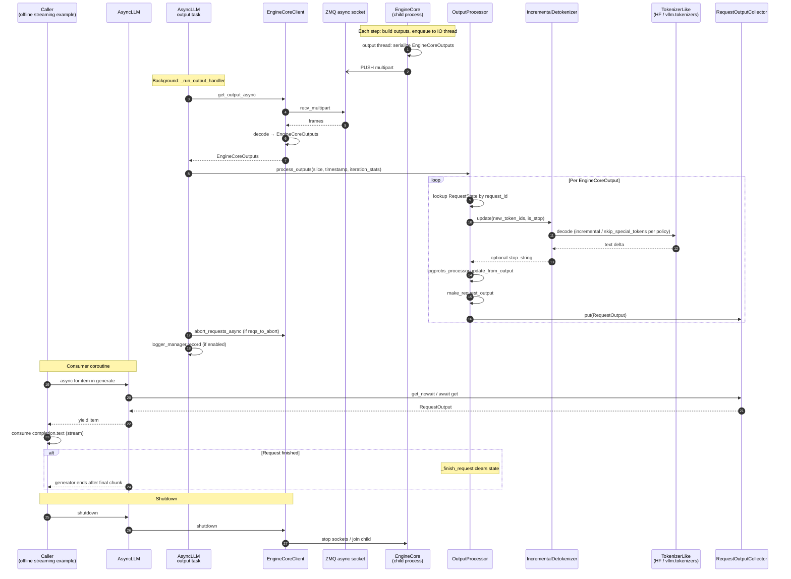

# vLLM AsyncLLM（meta-llama/Llama-3.2-1B-Instruct）

下面三个 Mermaid 时序图分别覆盖：**引擎初始化与模型加载**、**单步推理（一次 step）**、**流式回流（token 流出）**。`participant` 全部使用 `类名 (相对路径)` 的形式，从顶层 Python 入口一直贯通到底层 CUDA / FlashAttention 后端。

---

## 1. 引擎初始化与模型加载

```mermaid
sequenceDiagram
    autonumber
    participant Main as main (examples/offline_inference/async_llm_streaming.py)
    participant Args as AsyncEngineArgs (vllm/engine/arg_utils.py)
    participant LLM as AsyncLLM (vllm/v1/engine/async_llm.py)
    participant InProc as InputProcessor (vllm/v1/engine/input_processor.py)
    participant OutProc as OutputProcessor (vllm/v1/engine/output_processor.py)
    participant Client as AsyncMPClient (vllm/v1/engine/core_client.py)
    participant MPClient as MPClient (vllm/v1/engine/core_client.py)
    participant ProcMgr as CoreEngineProcManager (vllm/v1/engine/utils.py)
    participant Proc as EngineCoreProc (vllm/v1/engine/core.py)
    participant Core as EngineCore (vllm/v1/engine/core.py)
    participant Exec as MultiprocExecutor (vllm/v1/executor/multiproc_executor.py)
    participant WProc as WorkerProc (vllm/v1/executor/multiproc_executor.py)
    participant Worker as Worker (vllm/v1/worker/gpu_worker.py)
    participant Runner as GPUModelRunner (vllm/v1/worker/gpu_model_runner.py)
    participant Loader as DefaultModelLoader (vllm/model_executor/model_loader/default_loader.py)
    participant LlamaTop as LlamaForCausalLM (vllm/model_executor/models/llama.py)
    participant LlamaModel as LlamaModel (vllm/model_executor/models/llama.py)
    participant Sched as Scheduler (vllm/v1/core/sched/scheduler.py)
    participant Cuda as torch.cuda / NCCL (PyTorch)

    Main->>Args: AsyncEngineArgs(model="meta-llama/Llama-3.2-1B-Instruct")
    Main->>LLM: AsyncLLM.from_engine_args(engine_args)
    LLM->>Args: create_engine_config(usage_context)
    Args-->>LLM: VllmConfig (model/cache/parallel/scheduler/...)
    LLM->>LLM: __init__(vllm_config, executor_class=MultiprocExecutor)
    LLM->>InProc: InputProcessor(vllm_config, renderer)
    LLM->>OutProc: OutputProcessor(tokenizer, log_stats, stream_interval)
    LLM->>Client: EngineCoreClient.make_async_mp_client(vllm_config, executor_class)

    Client->>MPClient: __init__(asyncio_mode=True, ...)
    MPClient->>MPClient: zmq.Context + ROUTER(input) / PULL(output) sockets
    MPClient->>ProcMgr: launch_core_engines(vllm_config, executor_class, addresses)
    ProcMgr->>Proc: mp.Process(target=EngineCoreProc.run_engine_core).start()

    Note over Proc: ===== 子进程 EngineCore =====
    Proc->>Proc: _perform_handshakes(handshake_address) (ZMQ DEALER)
    Proc->>Core: super().__init__(vllm_config, executor_class, log_stats)
    Core->>Exec: MultiprocExecutor(vllm_config)
    Exec->>Exec: _init_executor() — 建 SHM MessageQueue (rpc_broadcast / response)
    Exec->>WProc: make_worker_process(local_rank, rank, …) × world_size
    WProc->>Worker: WorkerWrapperBase.init_worker(...) → Worker(vllm_config)
    Worker->>Cuda: torch.cuda.set_device(local_rank), init NCCL group
    Worker->>Runner: GPUModelRunner(vllm_config, device)
    Worker->>Worker: load_model()
    Worker->>Runner: model_runner.load_model()
    Runner->>Loader: get_model_loader(load_config).load_model(...)
    Loader->>LlamaTop: LlamaForCausalLM(vllm_config, prefix="")
    LlamaTop->>LlamaModel: LlamaModel(vllm_config) (Embed + N×LlamaDecoderLayer + Norm + lm_head)
    Loader-->>Runner: HuggingFace safetensors → 切分到 TP rank → 加载到 CUDA
    Runner-->>Worker: model 就绪
    WProc-->>Exec: READY (通过 ready_pipe)

    Core->>Core: _initialize_kv_caches(vllm_config)
    Core->>Exec: get_kv_cache_specs() / determine_available_memory()
    Exec->>Worker: collective_rpc("get_kv_cache_spec") / ("determine_available_memory")
    Worker->>Runner: profile_run() — 测 KV 可用显存
    Worker->>Cuda: torch.cuda.synchronize / mem_get_info
    Core->>Exec: initialize_from_config(kv_cache_configs)
    Exec->>Worker: collective_rpc("initialize_from_config" / "compile_or_warm_up_model")
    Worker->>Runner: 分配 KV cache blocks + torch.compile 预热 + CUDA Graph 捕获
    Core->>Sched: Scheduler(vllm_config, kv_cache_config, ...)
    Proc-->>MPClient: HELLO / READY (ZMQ handshake_socket)

    MPClient-->>Client: 各 EngineCore READY 收齐
    Client-->>LLM: AsyncMPClient 实例就绪
    LLM->>LLM: 若已有事件循环则 _run_output_handler()
    LLM-->>Main: engine = AsyncLLM 已就绪
```

要点说明：

-   `Executor.get_class` 会根据 `parallel_config.distributed_executor_backend` 选出要实例化的执行器类：若传入的是 类对象，则必须是 `Executor` 的子类，否则抛 `TypeError`；若是字符串 `"ray"`，则看 `VLLM_USE_RAY_V2_EXECUTOR_BACKEND` 选 `RayExecutorV2` 或 `RayDistributedExecutor`；`"mp"` / `"uni"` / `"external_launcher"` 分别对应多进程、单进程和外部启动器封装；若是 其它字符串，则当作全限定类名用 `resolve_obj_by_qualname` 解析，并再次校验是否为 `Executor` 子类；其它情况抛 `ValueError`。
-   `InputProcessor` 在 `AsyncLLM` 里负责「请求进引擎」：构造时把 `VllmConfig` 和共用的 `renderer` 存好，并挂一个 `InputPreprocessor`。真正干活在后面的 `process_inputs`：校验采样/池化参数、必要时用预处理器把原始 prompt 变成带 token id 的引擎输入，再结合多模态、LoRA、数据并行等，最终打包成发给 `EngineCore` 的 `EngineCoreRequest`。
-   `OutputProcessor` 负责「引擎结果回到调用方」：用与 `renderer` 相同的 `tokenizer`（以及 `log_stats`、流式间隔、是否 tracing）初始化。之后 `EngineCore` 返回的 `EngineCoreOutputs` 由它解码、整理成上层看到的 `RequestOutput`（含流式增量），保证输出侧和输入侧用同一套分词约定。

- `from_engine_args` 在 `vllm/engine/arg_utils.py` 中把 CLI/参数转为 `VllmConfig`；其中 `model` 会拉起 HF tokenizer / config（meta-llama/Llama-3.2-1B-Instruct）。
- `AsyncMPClient` 通过 ZMQ 的 ROUTER/PULL socket 与子进程 `EngineCoreProc` 解耦，`launch_core_engines` 负责真正 `fork/spawn`。
- `MultiprocExecutor` 用 SHM `MessageQueue` 广播 `collective_rpc`，每个 `WorkerProc` 内的 `Worker` 完成 `init_device → load_model → profile → compile/CUDAGraph → KV cache 分配`。

---

## 2. 单步推理（一次 EngineCore step）

```mermaid
sequenceDiagram
    autonumber
    participant Main as stream_response (examples/offline_inference/async_llm_streaming.py)
    participant LLM as AsyncLLM (vllm/v1/engine/async_llm.py)
    participant InProc as InputProcessor (vllm/v1/engine/input_processor.py)
    participant OutProc as OutputProcessor (vllm/v1/engine/output_processor.py)
    participant Client as AsyncMPClient (vllm/v1/engine/core_client.py)
    participant Proc as EngineCoreProc (vllm/v1/engine/core.py)
    participant Core as EngineCore (vllm/v1/engine/core.py)
    participant Sched as Scheduler (vllm/v1/core/sched/scheduler.py)
    participant Exec as MultiprocExecutor (vllm/v1/executor/multiproc_executor.py)
    participant WProc as WorkerProc (vllm/v1/executor/multiproc_executor.py)
    participant Worker as Worker (vllm/v1/worker/gpu_worker.py)
    participant Runner as GPUModelRunner (vllm/v1/worker/gpu_model_runner.py)
    participant LlamaTop as LlamaForCausalLM (vllm/model_executor/models/llama.py)
    participant LlamaModel as LlamaModel (vllm/model_executor/models/llama.py)
    participant Layer as LlamaDecoderLayer (vllm/model_executor/models/llama.py)
    participant Attn as Attention (vllm/model_executor/layers/attention/attention.py)
    participant FAImpl as FlashAttentionImpl (vllm/v1/attention/backends/flash_attn.py)
    participant FAIface as flash_attn_varlen_func (vllm/vllm_flash_attn/flash_attn_interface.py)
    participant FAKernel as _vllm_fa2_C / _vllm_fa3_C (csrc/.../flash_api.cpp + CUDA kernel)
    participant Sampler as Sampler (vllm/v1/sample/sampler.py)
    participant Cuda as CUDA Stream / KV Cache (torch + reshape_and_cache_flash)

    Main->>LLM: async for out in engine.generate(req_id, prompt, sampling_params)
    LLM->>LLM: add_request(req_id, prompt, params)
    LLM->>InProc: process_inputs(req_id, prompt, params, supported_tasks)
    InProc->>InProc: tokenizer.encode(prompt) → prompt_token_ids
    InProc-->>LLM: EngineCoreRequest(request_id, prompt_token_ids, sampling_params)
    LLM->>OutProc: add_request(request, prompt_text, parent_req=None, idx=0, queue)
    OutProc->>OutProc: 创建 RequestState + IncrementalDetokenizer + RequestOutputCollector
    LLM->>Client: add_request_async(EngineCoreRequest)
    Client->>Proc: zmq.send_multipart([engine_id, ADD, msgpack(EngineCoreRequest)])

    Note over Proc,Core: ===== EngineCoreProc.run_busy_loop =====
    Proc->>Proc: process_input_sockets 线程: socket.recv → input_queue
    Proc->>Core: _process_input_queue() → _handle_client_request(ADD, req)
    Core->>Sched: add_request(Request)

    Core->>Core: _process_engine_step() → step_fn = step()
    Core->>Sched: schedule()
    Sched->>Sched: 选 batch + 分配 KV blocks + build SchedulerOutput (block_table, slot_mapping, ...)
    Sched-->>Core: SchedulerOutput
    Core->>Exec: execute_model(scheduler_output, non_block=True)
    Exec->>Exec: rpc_broadcast_mq.enqueue(("execute_model", (sched_out,), ...))

    Note over WProc,Worker: ===== Worker 子进程 =====
    WProc->>WProc: worker_busy_loop() → dequeue("execute_model")
    WProc->>Worker: worker.execute_model(scheduler_output)
    Worker->>Runner: model_runner.execute_model(scheduler_output, intermediate_tensors)
    Runner->>Runner: _update_states / _prepare_inputs (input_ids, positions, slot_mapping → GPU)
    Runner->>Runner: set_forward_context(attn_metadata, ...)  # 给 Attention 层注入 metadata
    Runner->>LlamaTop: model(input_ids, positions, intermediate_tensors, inputs_embeds)
    LlamaTop->>LlamaModel: forward(input_ids, positions, ...)
    LlamaModel->>LlamaModel: embed_tokens(input_ids) → hidden_states
    loop 每个 LlamaDecoderLayer (1B 模型共 16 层)
        LlamaModel->>Layer: layer(positions, hidden_states, residual)
        Layer->>Layer: input_layernorm (RMSNorm fused)
        Layer->>Attn: self_attn.forward(positions, hidden_states)
        Attn->>Attn: qkv_proj + split + rotary_emb (RoPE CUDA op)
        Attn->>Attn: torch.ops.vllm.unified_attention_with_output(q,k,v,output,layer_name)
        Attn->>FAImpl: FlashAttentionImpl.forward(q,k,v,kv_cache,attn_metadata,output)
        FAImpl->>Cuda: reshape_and_cache_flash(k,v,key_cache,value_cache,slot_mapping)
        FAImpl->>FAIface: flash_attn_varlen_func(q,k_cache,v_cache,...,block_table,causal=True)
        FAIface->>FAKernel: torch.ops._vllm_fa2_C.varlen_fwd / _vllm_fa3_C.fwd(...)
        FAKernel-->>FAIface: out tensor (CUDA)
        FAIface-->>FAImpl: returns
        FAImpl-->>Attn: output
        Attn-->>Layer: o_proj(attn_out)
        Layer->>Layer: post_attention_layernorm + LlamaMLP (gate_up_proj/SiluAndMul/down_proj)
    end
    LlamaModel->>LlamaModel: norm(hidden_states, residual) → hidden_states
    LlamaModel-->>LlamaTop: hidden_states
    LlamaTop-->>Runner: hidden_states (CUDA Graph replay 路径)

    Runner-->>Worker: 缓存 logits / hidden_states，返回 None (异步采样模式)
    Worker-->>WProc: response (mq.enqueue)
    Exec-->>Core: future.result() → ModelRunnerOutput=None
    Core->>Sched: get_grammar_bitmask(scheduler_output)
    Core->>Exec: sample_tokens(grammar_output)
    Exec->>WProc: collective_rpc("sample_tokens", ...)
    WProc->>Worker: worker.sample_tokens(grammar_output)
    Worker->>Runner: model_runner.sample_tokens(grammar_output)
    Runner->>LlamaTop: compute_logits(hidden_states) (lm_head)
    Runner->>Sampler: sampler(logits, sampling_metadata)  # temperature/top_p/seed=42
    Sampler->>Cuda: top-k/top-p + multinomial (CUDA)
    Sampler-->>Runner: SamplerOutput(sampled_token_ids on GPU)
    Runner->>Runner: _bookkeeping_sync (D2H copy of token_ids, logprobs)
    Runner-->>Worker: ModelRunnerOutput(req_ids, sampled_token_ids, logprobs, ...)
    Worker-->>WProc: response
    Exec-->>Core: ModelRunnerOutput

    Core->>Sched: update_from_output(scheduler_output, model_output)
    Sched-->>Core: dict[client_idx → EngineCoreOutputs] (含 new_token_ids)
    Core->>Proc: output_queue.put_nowait((client_idx, EngineCoreOutputs))
```

要点说明：
- `step` 与 `sample_tokens` 是 V1 调度的解耦点：先发出非阻塞 `execute_model`（前向 + KV 写入），再由 `sample_tokens` 拿到 logits 后采样，便于流水线/CUDA Graph 重放。
- Attention 走 `unified_attention_with_output` 自定义算子 → `FlashAttentionImpl.forward` → `flash_attn_varlen_func` → `torch.ops._vllm_fa2_C.varlen_fwd` / `_vllm_fa3_C.fwd`，最终落到 `csrc/` 下的 FlashAttention CUDA kernel；KV 写入由 `reshape_and_cache_flash` 这个 CUDA op 完成（Paged KV 的 `block_table + slot_mapping`）。
- `Sampler` 内部对 1B 模型做温度缩放 / top-p / multinomial，全部走 CUDA op。

---

## 3. 流式回流（token-by-token 出口）

要点说明：
- `_run_output_handler` 是 `AsyncLLM` 在事件循环中常驻的后台任务，负责把 ZMQ 拉过来的 `EngineCoreOutputs` 喂给 `OutputProcessor`，并把每条请求的 `RequestOutput` 推到对应的 `RequestOutputCollector` 队列。
- `RequestOutputKind.DELTA` 模式下，`make_request_output` 只把本次新生成的 token 文本/ID 写入 `output.outputs[*].text`，例子里看到的就是这部分增量。
- 调用方协程 `generate()` 的 `async for` 直接消费上面那个 per-request 队列：`q.get_nowait() or await q.get()`，无锁的 fast path 用于负载较高时减少任务切换。
- 整个流式链路是 **生产者（EngineCore 子进程，ZMQ PUSH） → 消费者（AsyncLLM 后台 task） → 每请求 asyncio 队列 → 用户协程** 的三段式。

---

## 文件位置速查

### 用户入口和参数
- `examples/offline_inference/async_llm_streaming.py`
  - `main()`、`stream_response()`
- `vllm/sampling_params.py`
  - `SamplingParams`、`SamplingParams.__post_init__`、`update_from_generation_config`、`update_from_tokenizer`
- `vllm/engine/arg_utils.py`
  - `EngineArgs`、`AsyncEngineArgs`、`EngineArgs.create_engine_config`

### 前端引擎（asyncio 进程）
- `vllm/v1/engine/async_llm.py`
  - `AsyncLLM`、`AsyncLLM.__init__`、`from_engine_args`、`add_request`、`_add_request`、`generate`、`_run_output_handler`、`output_handler`、`abort`、`shutdown`
- `vllm/v1/engine/input_processor.py`
  - `InputProcessor`、`process_inputs`、`assign_request_id`、`_validate_params`
- `vllm/v1/engine/output_processor.py`
  - `OutputProcessor`、`OutputProcessor.add_request`、`process_outputs`、`RequestState`、`RequestState.from_new_request`、`RequestOutputCollector`
- `vllm/v1/engine/detokenizer.py`
  - `IncrementalDetokenizer.update`
- `vllm/v1/engine/logprobs.py`
  - `LogprobsProcessor.update_from_output`
- `vllm/v1/engine/__init__.py`
  - `EngineCoreRequest`、`EngineCoreOutput`、`EngineCoreOutputs`、`EngineCoreRequestType`、`EngineCoreReadyResponse`

### 多进程 / ZMQ 客户端
- `vllm/v1/engine/core_client.py`
  - `EngineCoreClient`、`MPClient`、`AsyncMPClient`、`DPAsyncMPClient`、`DPLBAsyncMPClient`
  - `EngineCoreClient.make_async_mp_client`、`MPClient.__init__`（建 ROUTER/PULL）、`MPClient._send_input`、`AsyncMPClient.get_output_async`、`AsyncMPClient.add_request_async`
- `vllm/v1/engine/utils.py`
  - `launch_core_engines`、`get_engine_zmq_addresses`、`make_zmq_socket`

### EngineCore 后端进程
- `vllm/v1/engine/core.py`
  - `EngineCore`、`EngineCore.__init__`、`_initialize_kv_caches`、`add_request`、`step`、`step_with_batch_queue`
  - `EngineCoreProc`、`run_engine_core`、`run_busy_loop`、`_process_input_queue`、`_process_engine_step`、`_handle_client_request`、`process_input_sockets`、`process_output_sockets`、`startup_handshake`
  - `DPEngineCoreProc`
- `vllm/v1/core/sched/scheduler.py`
  - `Scheduler`、`Scheduler.add_request`、`schedule`、`update_from_output`
- `vllm/v1/core/sched/output.py`
  - `SchedulerOutput`

### Executor / Worker
- `vllm/v1/executor/abstract.py`
  - `Executor`、`Executor.get_class`、`collective_rpc`、`execute_model`、`sample_tokens`、`initialize_from_config`、`determine_available_memory`
- `vllm/v1/executor/uniproc_executor.py`
  - `UniProcExecutor._init_executor`、`collective_rpc`、`execute_model`
- `vllm/v1/executor/multiproc_executor.py`
  - `MultiprocExecutor`、`WorkerProc`
- `vllm/v1/worker/worker_base.py`
  - `WorkerBase`、`WorkerWrapperBase.init_worker`、`init_device`、`load_model`、`initialize_from_config`、`execute_model`
- `vllm/v1/worker/gpu_worker.py`
  - `Worker`（继承 `WorkerBase`），`Worker.init_device`、`load_model`、`determine_available_memory`、`initialize_from_config`、`compile_or_warm_up_model`、`execute_model`、`init_worker_distributed_environment`

### Model Runner 与 CUDA Graph
- `vllm/v1/worker/gpu_model_runner.py`
  - `GPUModelRunner.__init__`、`load_model`、`initialize_kv_cache`、`_dummy_run`、`capture_model`、`execute_model`、`_determine_batch_execution_and_padding`、`_check_and_update_cudagraph_mode`
- `vllm/v1/worker/gpu/cudagraph_utils.py`
  - `CudagraphDispatcher`、`EagleCudaGraphManager` 等
- `vllm/forward_context.py`
  - `set_forward_context`、`BatchDescriptor`

### 模型加载
- `vllm/model_executor/model_loader/__init__.py`
  - `get_model_loader`、`get_model`
- `vllm/model_executor/model_loader/base_loader.py`
  - `BaseModelLoader.load_model`（调用 `initialize_model` + `load_weights` + `process_weights_after_loading`）
- `vllm/model_executor/model_loader/default_loader.py`
  - `DefaultModelLoader`、`_prepare_weights`（`download_weights_from_hf`、`safetensors_weights_iterator`）、`_get_weights_iterator`、`load_weights`
- `vllm/model_executor/model_loader/utils.py`
  - `initialize_model`、`process_weights_after_loading`
- `vllm/model_executor/model_loader/weight_utils.py`
  - `download_weights_from_hf`、`safetensors_weights_iterator`、`default_weight_loader`

### Llama 模型实现
- `vllm/model_executor/models/llama.py`
  - `LlamaMLP`、`LlamaAttention`、`LlamaDecoderLayer`、`LlamaModel`、`LlamaForCausalLM`
  - `LlamaModel.load_weights`（含 `q_proj/k_proj/v_proj -> qkv_proj`、`gate_proj/up_proj -> gate_up_proj` 合并规则）

### 模型基础层 / 自定义算子
- `vllm/model_executor/layers/linear.py`
  - `MergedColumnParallelLinear`、`QKVParallelLinear`、`RowParallelLinear`
- `vllm/model_executor/layers/layernorm.py`
  - `RMSNorm`、`fused_add_rms_norm`（调 `ops.fused_add_rms_norm`，C++ kernel）
- `vllm/model_executor/layers/activation.py`
  - `SiluAndMul`（调 `torch.ops._C.silu_and_mul`）
- `vllm/model_executor/layers/rotary_embedding/common.py`
  - `ApplyRotaryEmb` / `get_rope`
- `vllm/model_executor/layers/vocab_parallel_embedding.py`
  - `VocabParallelEmbedding`、`ParallelLMHead`
- `vllm/model_executor/layers/logits_processor.py`
  - `LogitsProcessor`

### Attention 后端
- `vllm/model_executor/layers/attention/attention.py`
  - `Attention`（顶层 `nn.Module`，封装 KV cache + dispatch backend）
- `vllm/v1/attention/selector.py`
  - `get_attn_backend`
- `vllm/v1/attention/backends/flash_attn.py`
  - `FlashAttentionBackend`、`FlashAttentionMetadata`、`FlashAttentionMetadataBuilder`、`FlashAttentionImpl.forward`
  - 调 `flash_attn_varlen_func`（FA2/FA3 wrapper，位于 `vllm/v1/attention/backends/fa_utils.py`）
- `vllm/_custom_ops.py`
  - `reshape_and_cache_flash`、`silu_and_mul`、`fused_add_rms_norm` 等 Python 绑定
- `csrc/torch_bindings.cpp` / `csrc/ops.h`
  - 注册到 `torch.ops._C` 的 CUDA kernel：`silu_and_mul`、`rms_norm`、`fused_add_rms_norm`、`reshape_and_cache_flash`、`rotary_embedding` 等

### 采样
- `vllm/v1/sample/sampler.py`
  - `Sampler`、`Sampler.forward`、`apply_temperature`、`greedy_sample`、`sample`、`gather_logprobs`
- `vllm/v1/sample/ops/topk_topp_sampler.py`
  - `TopKTopPSampler`、`forward_cuda`（FlashInfer 路径）、`forward_native`、`apply_top_k_top_p_pytorch`、`random_sample`
- `vllm/v1/sample/ops/topk_topp_triton.py`
  - `apply_top_k_top_p_triton`
- `vllm/v1/sample/ops/penalties.py` / `vllm/v1/sample/ops/bad_words.py`
  - `apply_all_penalties`、`apply_bad_words`

整条链路就是：用户在 `async_llm_streaming.py` 中用 `AsyncEngineArgs` 把 Llama-3.2-1B 喂进 `AsyncLLM` → `EngineCoreClient.make_async_mp_client` 起一个独立 `EngineCoreProc` 进程，并用 ZMQ ROUTER/DEALER 与 PUSH/PULL 双通道连接 → 后端 `Executor → Worker → GPUModelRunner → DefaultModelLoader` 把 safetensors 权重按 `qkv_proj`、`gate_up_proj` 等合并规则装入 `LlamaForCausalLM`，再 profile + 分配 KV cache + （`enforce_eager=False` 时）`capture_model` 录制 CUDA Graph → `Scheduler` 调度后由 `GPUModelRunner.execute_model` 在 `set_forward_context` 内调用 Llama 各子层（`RMSNorm`/`QKVParallelLinear`/`ApplyRotaryEmb`/`Attention → FlashAttentionImpl → reshape_and_cache_flash + flash_attn_varlen_func`/`SiluAndMul`/`RowParallelLinear`），输出 logits 进 `Sampler → TopKTopPSampler` → `EngineCoreOutputs` 经 ZMQ 回到前端 `AsyncLLM.output_handler`，再由 `OutputProcessor + IncrementalDetokenizer` 转成 `RequestOutput` 投递到 `RequestOutputCollector`，最终被 `async for` 拿到并 `print` 出来。
